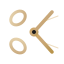

<div align="center">
  <br/>
  
  <br/>
  <h1>BlackStag Barbershop</h1>
  <p>
    <strong>Premium Grooming Experience — Where Style Meets Precision</strong>
  </p>

  [🌐 Live Demo](https://website-barbershop-two.vercel.app) · [Features](#features) · [Tech Stack](#tech-stack) · [Getting Started](#getting-started) · [Project Structure](#project-structure)
  <br/>
</div>

---

A modern, responsive barbershop website built with **Next.js 16**, **Tailwind CSS**, and **Framer Motion**. Features a rich dark/light theme, interactive booking wizard, gallery lightbox, and full SEO optimization.

> ⚠️ **Demo Site** — This website is for demonstration purposes only and is not a real barbershop. The booking wizard and contact form simulate real functionality — no data is stored or sent to a real barbershop.

## ✨ Features

### 🎨 Design & UI
- **Dark & Light Mode** — Smooth theme switching with warm cream light mode and premium dark mode
- **Custom Gold Accents** — Consistent brand identity with gold (#C8A87C) gradients and accents
- **Responsive Layout** — Fully adaptive from 320px mobile to 4K desktop
- **Micro-interactions** — Hover glows, animated counters, scroll progress bar, and floating icon animations
- **Back to Top** — Floating button appears on scroll for easy navigation
- **Noise Texture Overlay** — Subtle grain texture for depth and richness

### 🧭 Sections
| Section | Description |
|---------|-------------|
| **Hero** | Animated headline, CTA buttons, floating icons, rotating rings, live stats counters |
| **About** | Brand story, stats grid, floating award card, CTA |
| **Services** | Category filter tabs, service cards with prices/duration, animated layout transitions |
| **Gallery** | Filterable masonry grid, lightbox dialog with keyboard navigation |
| **Team** | Barber profiles with ratings, specialties, and booking CTAs |
| **Testimonials** | Auto-playing carousel with star ratings |
| **FAQ** | Accordion-style Q&A with smooth expand/collapse |
| **Booking** | 5-step booking wizard (Service → Barber → Date/Time → Info → Confirm) |
| **Contact** | Contact form with validation, social links, address, business hours and info |

### ♿ Accessibility
- ARIA roles (`tablist`, `tab`, `tabpanel`) on filter controls
- Keyboard navigation (Arrow keys for tabs, Escape for modals)
- **`prefers-reduced-motion`** support — disables animations for vestibular disorders
- Focus-visible ring styling
- Semantic HTML with proper heading hierarchy

### ⚡ Performance & SEO
- **Optimized for performance** — Lazy loading, optimized images, minimal JavaScript footprint
- **Next.js App Router** — Static generation, route-level code splitting
- **JSON-LD Structured Data** — schema.org LocalBusiness for rich search results
- **Open Graph + Twitter Cards** — Social sharing previews
- **Sitemap.xml** — Search engine indexing
- **PWA Manifest** — Install prompt support
- **Lazy Image Loading** — Native `loading="lazy"` with CSS blur-up fade-in placeholders
- **Custom SVG Favicon** — Brand-matched scissors icon

## 🛠️ Tech Stack

| Technology | Purpose |
|------------|---------|
| **Next.js 16** | React framework with App Router |
| **TypeScript** | Type-safe development |
| **Tailwind CSS 3** | Utility-first styling |
| **Framer Motion** | Declarative animations & gestures |
| **next-themes** | Dark/light mode with `class` strategy |
| **shadcn/ui** | Accessible component primitives |
| **Lucide React** | Icon library |
| **Embla Carousel** | Lightweight carousel for testimonials |
| **Geist Font** | Primary sans-serif (body text) |
| **Outfit Font** | Secondary sans-serif (body utility) |
| **Playfair Display** | Serif display (headings) |
| **Open Sans** | Variable-weight fallback font |

## 🚀 Getting Started

### Prerequisites
- **Node.js** 22.x or later
- **npm**, **pnpm**, or **bun**

### Installation

```bash
# Clone the repository
git clone https://github.com/nick0221/barbershop-website.git
cd barbershop-website

# Install dependencies
npm install

# Start the development server
npm run dev
```

Open [http://localhost:3000](http://localhost:3000) in your browser.

### Build for Production

```bash
npm run build
npm start
```

## 📁 Project Structure

```
barbershop-website/
├── public/
│   ├── images/           # Gallery and hero images
│   ├── favicon.svg       # Custom SVG favicon
│   └── site.webmanifest  # PWA manifest
├── src/
│   ├── app/
│   │   ├── api/
│   │   │   └── contact/  # Contact form API route
│   │   ├── globals.css   # Global styles, CSS variables, theme tokens
│   │   ├── layout.tsx    # Root layout, fonts, metadata, SEO
│   │   ├── page.tsx      # Main page composing all sections
│   │   └── sitemap.ts    # Auto-generated sitemap.xml
│   ├── components/
│   │   ├── AnimatedCounter.tsx  # Scroll-triggered number counter
│   │   ├── BackToTop.tsx        # Floating scroll-to-top button
│   │   ├── CursorGlow.tsx       # Ambient cursor follower glow
│   │   ├── DemoBanner.tsx       # Dismissible demo notice banner
│   │   ├── ScrollProgress.tsx   # Reading progress bar at top
│   │   ├── ThemeToggle.tsx      # Dark/light mode switch
│   │   ├── layout/       # Navbar, Footer
│   │   ├── sections/     # Hero, About, Services, Gallery, Team, etc.
│   │   └── ui/           # Button, Card, Accordion, Tabs, Dialog, etc.
│   ├── hooks/
│   │   └── useReducedMotion.ts
│   └── lib/
│       └── utils.ts      # cn() utility
├── tailwind.config.ts
├── tsconfig.json
└── package.json
```

## 🔧 Configuration

### Theme
The site uses **next-themes** with `class` strategy. Default is dark mode. Toggle via the sun/moon icon in the navbar.

### Brand Colors
| Token | Hex | Usage |
|-------|-----|-------|
| `gold` | `#C8A87C` | Primary accent, CTAs, highlights |
| `bronze` | `#8B6914` | Secondary accent, gradients |
| `cream` | `--cream` (dynamic) | Primary text (dark) / background (light) |
| `dark-*` | `--dark-*` (dynamic) | Background shades |

### Environment Variables
No environment variables are required to run locally.

## 📄 License

This project is for demonstration purposes only. All images and brand content are placeholders.

---

<div align="center">
  <p>
    Built with ❤️ using <a href="https://nextjs.org">Next.js</a>
  </p>
  <p>
    <a href="https://website-barbershop-two.vercel.app">Live Demo</a>
    &nbsp;·&nbsp;
    <a href="https://github.com/nick0221/barbershop-website">GitHub</a>
  </p>
</div>
